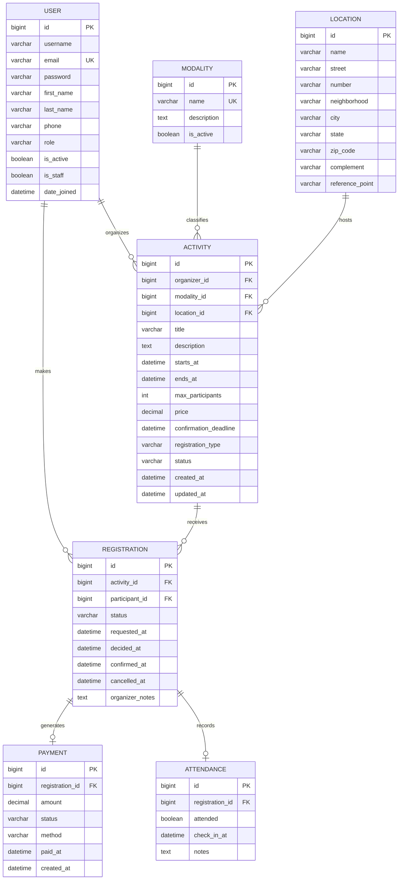

# Diagrama Entidade-Relacionamento

Este diagrama representa a modelagem relacional do sistema de gerenciamento de atividades físicas coletivas.

## Relacionamentos principais

- Um usuário pode organizar várias atividades.
- Um usuário pode possuir várias inscrições.
- Uma modalidade pode estar associada a várias atividades.
- Um local pode receber várias atividades.
- Uma atividade pode possuir várias inscrições.
- Uma inscrição pode possuir no máximo um pagamento.
- Uma inscrição pode possuir no máximo um registro de presença.

## Restrições principais

- Um participante não pode possuir mais de uma inscrição para a mesma atividade.
- O limite de participantes deve ser maior que zero.
- O valor da atividade não pode ser negativo.
- O horário de término deve ser posterior ao horário de início.
- O prazo de confirmação deve ocorrer antes do início da atividade.